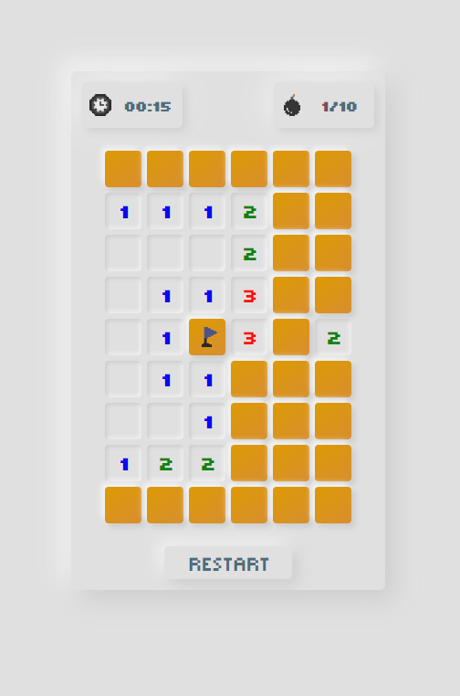

# NeoMines

NeoMines is a reinvented Minesweeper with a neumorphism design, built with Blazor and .NET 9. Enjoy a clean, modern look while testing your skills to uncover hidden mines. A classic reimagined with a sleek, modern touch.



## Features

- **Elegant Neumorphic Design**: A minimalist, neumorphic interface for an immersive gaming experience.
- **Built with Blazor and .NET 9**: Combining the latest web technologies for a responsive, fast gameplay experience.
- **Classic Minesweeper Gameplay**: All the classic rules of Minesweeper, with a modern twist.

## Gameplay Rules

In NeoMines, the objective is to clear the minefield without detonating any hidden mines. The grid is filled with numbers that reveal how many mines are adjacent to each cell, helping you to strategically uncover safe cells.

1. **Reveal Cells**: Click on cells to reveal them.
    - If a cell contains a mine, the game is over.
    - If the cell is empty, it displays a number indicating the count of eight adjacent mines.
2. **Flag Mines**: Right-click or long-press (on mobile) to place a flag where you suspect a mine. Flags help you keep track of potential mine locations.
3. **Win Condition**: The game is won when all non-mine cells are revealed, and all mines are flagged.

## Getting Started

Clone this repository, navigate to the project folder, and follow these steps:

1. **Install .NET 9 SDK**: Ensure .NET 9 SDK is installed. You can download it [here](https://dotnet.microsoft.com/download).
2. **Run the Project**:
    ```bash
    dotnet run --project NeoMines
    ```
3. **Access NeoMines**: Open your browser and go to the provided URL (typically `http://localhost:5260`).

## Play NeoMines Online

You can access the live version of NeoMines here: [NeoMines Online](https://neomines.azurewebsites.net).

---

## License

This project is licensed under the MIT License.

---

Enjoy the game! Test your strategic thinking and enjoy the sleek, modernized Minesweeper experience with NeoMines.
